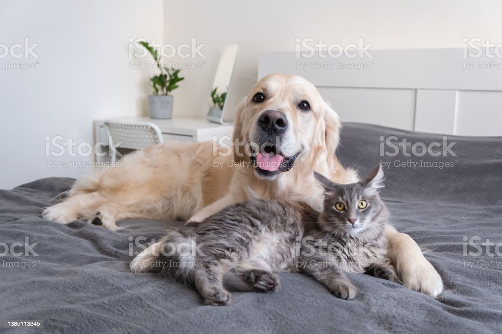

# Formating
**Bold**
*Italic*
**This is bold _Only this is Italic_ and bolds**

# H1 Heading
## H2 Heading
### H3 Heading
#### H4 Heading
##### H5 Heading
###### H6 Heading

# The Cooper Union Summer Writing Program prepares you for college by giving you the writing and thinking tools you need. 
## Participants who complete all assigned work and attend all sessions earn a non-credit bearing Certificate of Complete

# QUote Example
This is SImple Data
> This is quote data

# This is quote code.
This is inline `command` single line.
```
<?php
echo phpifno();
?>
```

# Links
This is the [Google](http://google.com)
This is the [Github](http://github.com)
 
 # image
 

 # images
 

 # image
 

 # List
 * Apple
 * Mango
 * Banana

 1. Red
 2. Green
 3. Yellow

 1. List Order
    * sublist   
      *sublisted